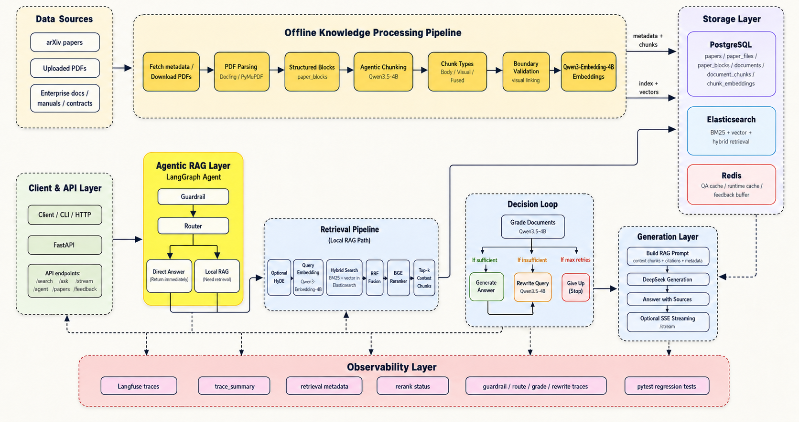
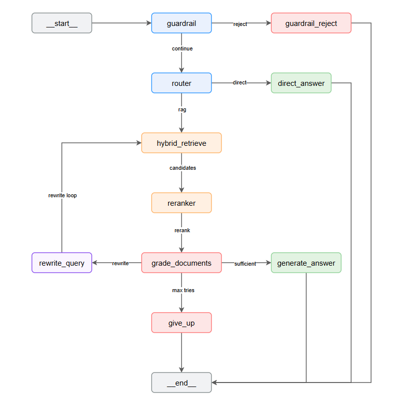

# RAG_researcher

> **A local-first, Agentic RAG engine engineered for complex documents and long-form technical literature.**


---

## 📌 Overview

Standard vanilla RAG often fails on complex, multi-page PDFs (such as scientific papers and enterprise manuals) due to degraded long-context recall, lost table/figure context, and rigid retrieval flows.

**RAG_researcher** tackles these challenges with:
- **Agentic Chunking**: Intelligently identifies document section boundaries rather than blindly splitting by character counts.
- **Multimodal Evidence Handling**: Preserves markdown tables, figure captions, and structured metadata alongside body text.
- **Hybrid Retrieval & Reranking**: Combines Elasticsearch BM25, dense vector embeddings, optional HyDE query expansion, and cross-encoder reranking.
- **LangGraph Agent Workflow**: Dynamically grades retrieved evidence, rewrites deficient queries, and ensures verifiable source attribution.
- **Interactive Web UI & REST API**: Includes a Streamlit chat dashboard for uploading documents and testing queries, plus high-performance FastAPI endpoints.

---

## 🏗️ Architecture

### System Architecture


### Agent Workflow


```text
User Query
  │
  ▼
[ Guardrail & Intent Classification ]
  │
  ├─► Direct Answer (General queries)
  │
  └─► [ Hybrid Retrieval: BM25 + Vector Search (RRF) ]
        │
        ▼
      [ Cross-Encoder Reranker ]
        │
        ▼
      [ Document Grader (Relevance Check) ]
        │
        ├── All Relevant ──► [ Answer Generator with Citations ]
        │
        └── Low Relevance ─► [ Query Rewriter ] ──► (Loop back to Search)
```

---

## ⚡ Quick Start

### 1. Prerequisites
- Python 3.13+
- [uv](https://github.com/astral-sh/uv) (recommended)
- Docker & Docker Compose
- [Ollama](https://ollama.ai) running locally

### 2. Installation

Clone the repository and install dependencies:
```bash
git clone https://github.com/hoanganh2910/RAG_researcher.git
cd RAG_researcher
uv sync
```

### 3. Start Infrastructure Services

Spin up PostgreSQL, Elasticsearch, Kibana, and Redis:
```bash
docker compose up -d
```

### 4. Configuration

Copy the example environment file and configure your settings:
```bash
cp .env.example .env
```

Ensure your local Ollama models are pulled:
```bash
ollama pull nomic-embed-text
ollama pull llama3.2
```

### 5. Run the Application

**Start the FastAPI Backend:**
```bash
uv run uvicorn app.main:app --reload --port 8000
```
API Documentation will be available at [http://localhost:8000/docs](http://localhost:8000/docs).

**Start the Streamlit Web Interface:**
```bash
uv run streamlit run frontend.py
```
Open your browser at [http://localhost:8501](http://localhost:8501) to interact with the chatbot and upload PDFs.

---

## 📊 Evaluation & Benchmark Results

Our comprehensive ablation studies demonstrate the superiority of the RAG_researcher architecture over standard naive RAG pipelines.

*Note: The following highlights focus on **MRR@10 (Mean Reciprocal Rank)**, where a score closer to 1.0 means the correct answer is consistently returned at the very top of the search results.*

### 1. Agentic Chunking vs. Fixed Chunking
- **Performance Lift**: Switching from naive character-based splitting to **Agentic Chunking** yields a massive **+26% improvement in MRR**.
- **Why it matters**: By keeping semantic boundaries intact (grouping related sentences intelligently rather than slicing them mid-thought), the search engine captures the true context of complex paragraphs.

### 2. Preserving Visuals (Figures & Tables)
- **Performance Lift**: On a dataset strictly evaluating questions about charts and tabular data, our specialized visual/table chunks improved MRR by **+19.7%**.
- **Why it matters**: Standard RAG destroys table formatting. RAG_researcher isolates and fuses table/figure metadata so the LLM can still "see" the structured data accurately.

### 3. The Ultimate Retrieval Stack
- **BM25 & Dense Search**: Fast but occasionally miss nuanced queries (MRR ~0.75).
- **Hybrid Search**: Fusing keywords with semantic vectors bumps MRR to **~0.80**, ensuring the correct document is almost always in the top 2.
- **Hybrid + Reranking (BGE-Reranker-v2-m3)**: Passing the Hybrid results through a Cross-Encoder Reranker pushes the MRR to an outstanding **0.90**.
- **The Trade-off**: While Reranking guarantees near-perfect Top-1 accuracy, it significantly increases computational latency. The system allows toggling these features based on your hardware capabilities.

---

## 🔌 API Endpoints

| Method | Endpoint | Description |
| :--- | :--- | :--- |
| `GET` | `/api/v1/health` | Service health status check |
| `POST` | `/api/v1/search` | Direct hybrid retrieval (BM25 + Dense) |
| `POST` | `/api/v1/ask` | Single-shot RAG question answering |
| `POST` | `/api/v1/agent` | Full LangGraph agentic reasoning flow |
| `POST` | `/api/v1/stream` | Server-Sent Events (SSE) streaming response |

---

## 🧪 Testing & Evaluation

Run the unit test suite:
```bash
uv run pytest
```

Execute retrieval benchmarks:
```bash
uv run rag_researcher-eval benchmark --dataset data/eval/qa_gold.json
```

---

## 📂 Project Structure

```text
├── app/                        # FastAPI application, routing, and schemas
├── frontend.py                 # Streamlit interactive chat UI
├── src/rag_researcher/
│   ├── agent/                  # LangGraph state machine, nodes, and policies
│   ├── chunking/               # Agentic, block, and fixed chunking algorithms
│   ├── cli/                    # Command-line tools for ingestion and evaluation
│   ├── embedding/              # Vector embedding wrappers and repositories
│   ├── evaluation/             # Evaluation metrics and benchmark harness
│   ├── ingestion/              # Document loaders and hashing
│   ├── papers/                 # PDF parsers (Docling, PyMuPDF) and arXiv client
│   ├── pipeline/               # End-to-end ingestion pipeline runners
│   ├── reranking/              # Cross-encoder reranker wrappers
│   └── retrieval/              # Elasticsearch vector/BM25 search & HyDE
├── docker-compose.yml          # Container configuration (Postgres, ES, Redis)
├── pyproject.toml              # Project dependencies and CLI entrypoints
└── tests/                      # Automated test suite (200+ unit tests)
```

---

## 📝 License

Distributed under the MIT License. See `LICENSE` for more information.
